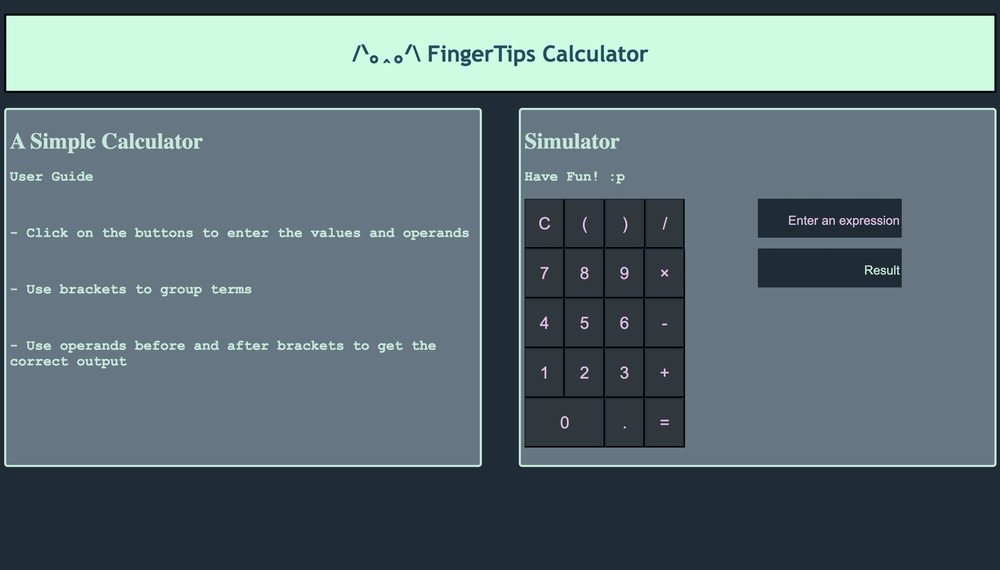
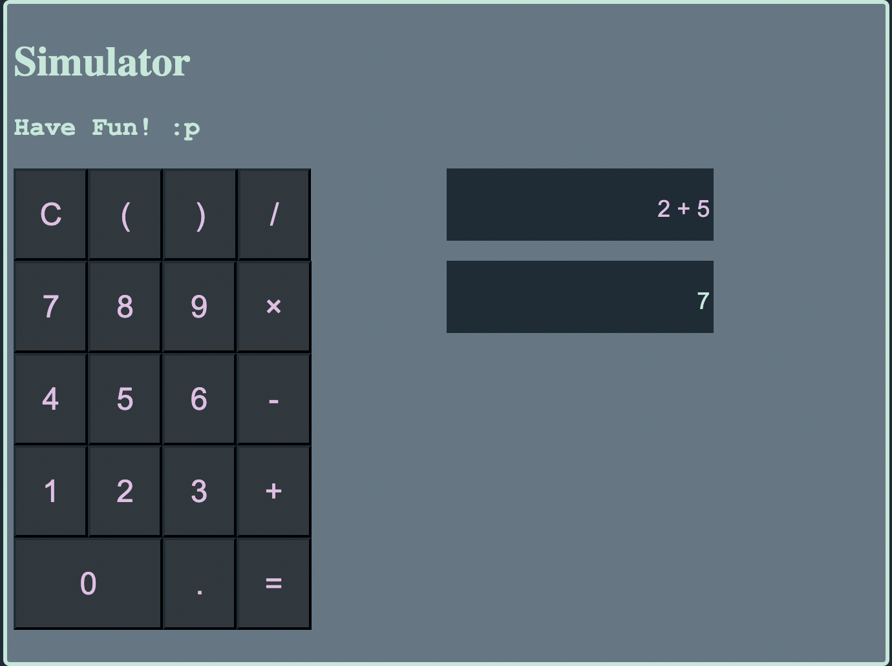

## FingerTips Calculator: A simple calculator program

This program uses HTML to struture the webpage and uses CSS to style the page.

The javascript file contains functions that return appended expression on calling it. The fucntion calls are invoked onclick when a button click is made.

Additional function are used to prevent successive operator entries by user.

Credits:
Array expression evaluation from Geeks For Geeks.

<https://www.geeksforgeeks.org/expression-evaluation/>

